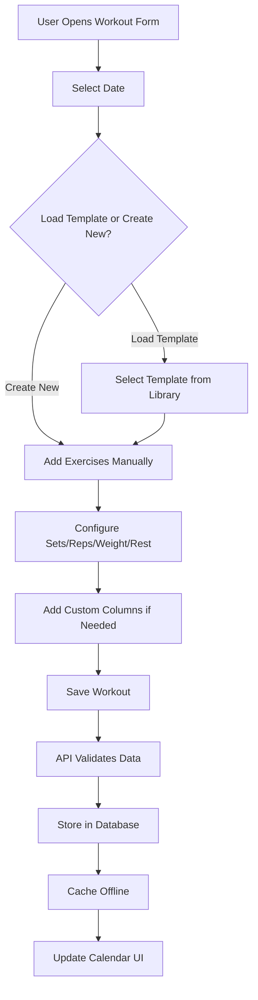
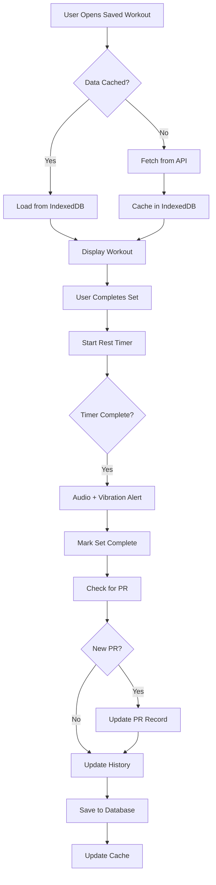
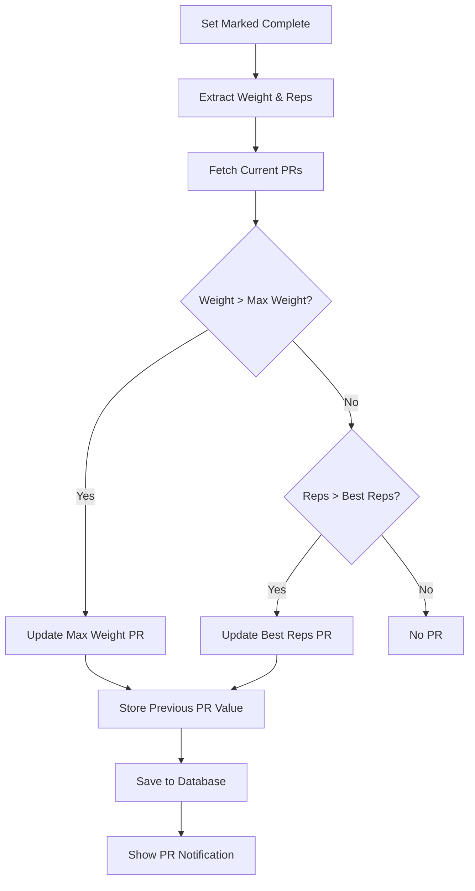
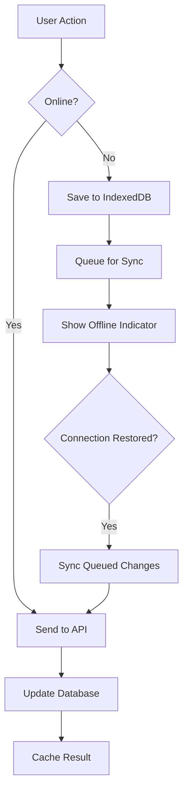

# 🏋️ WorkoutRegister - Mi Entrenamiento

> A modern, full-stack Progressive Web App (PWA) for comprehensive workout tracking with offline support, personal records tracking, and detailed performance analytics.


---

## 📑 Index
- [🌟 Key Features](#-key-features)
- [🆕 Latest Updates](#-latest-updates)
- [🛠️ Tech Stack](#️-tech-stack)
- [🚀 API Routes](#-api-routes)
- [🔐 Authentication & Authorization](#-authentication--authorization)
- [📱 Key Components](#-key-components)
- [🌐 Internationalization (i18n)](#-internationalization-i18n)
- [📦 Installation & Setup](#-installation--setup)
- [🗂️ Project Structure](#️-project-structure)
- [🔄 Data Flow](#-data-flow)
- [🎯 Key Features Implementation](#-key-features-implementation)
- [🧪 Testing & Quality](#-testing--quality)
- [🚧 Roadmap](#-roadmap)
- [📄 License](#-license)
- [👤 Author](#-author)

---

## 🌟 Key Features

### 🏋️ Workout Planning & Tracking
- **Interactive Calendar View**: Visual calendar interface to plan and track workouts with status indicators
- **Flexible Workout Creation**: Create custom workouts with multiple exercises
- **Rest Day Management**: Mark days as rest days for proper recovery tracking
- **Workout Postponement**: Postpone individual workouts or entire workout sequences
- **Real-time Completion Tracking**: Mark exercises and individual sets as completed
- **Drag & Drop Exercise Reordering**: Easily reorganize exercises within your workout

### 💪 Exercise Management
- **Pre-loaded Exercise Library**: 100+ exercises categorized by 15 muscle groups
- **Custom Exercise Creation**: Create and save your own exercises with muscle group assignment
- **Muscle Group Categorization**: 
  - Upper Body: Chest, Back, Front/Middle/Rear Deltoids, Biceps, Triceps, Forearms
  - Lower Body: Quadriceps, Hamstrings, Glutes, Calves, Abductors
  - Core: Abs, Obliques
- **Exercise Details**: Track sets, reps, weight, and rest time for each exercise
- **Exercise History & PRs**: View complete exercise history and track personal records
  - **Max Weight PR**: Automatically tracks your heaviest lift with reps
  - **Best Performance PR**: Tracks best rep count (for bodyweight exercises)
  - **PR Date Tracking**: See when you achieved each personal record
  - **Historical Progress Charts**: Visualize your strength progression over time
  - **Last Workout Comparison**: Compare current performance vs previous session

### ⏱️ Smart Rest Timer
- **Exercise-Specific Timers**: Each exercise has its own configurable rest timer
- **Background Operation**: Timer continues running even when the app is in the background or screen is off
- **Audio & Vibration Alerts**: Get notified when rest period is complete
- **Minimizable Overlay**: Non-intrusive overlay that can be minimized while staying active
- **Auto-Progress**: Automatically mark sets as complete and start the next set's timer
- **Time Adjustments**: Add or subtract time on the fly with +/-15s and +/-30s buttons
- **Persistent State**: Timer state survives page refreshes and tab switching
- **Visual Progress**: Circular progress indicator showing time remaining

### 📊 Advanced Tracking
- **Custom Columns**: Create custom data fields (RIR, RPE, notes, tempo, etc.)
- **Flexible Data Types**: Support for text, number, and boolean columns
- **Set-by-Set Recording**: Track individual set performance with custom data
- **Workout State Management**: Save, expand/collapse, and complete exercises
- **Workout Templates**: Save favorite workouts as templates for quick reuse
- **Template Management**: Create, load, and delete workout templates

### 📈 Statistics & Analytics
- **Weekly Progress Analysis**: Visual representation of your training week
- **Muscle Group Distribution**: See which muscle groups you're training
- **Training Metrics**:
  - Training days vs rest days
  - Plan compliance percentage (actual vs planned sets)
  - **Realistic Training Time Estimates**: Improved calculation considering:
    - Rep duration based on intensity (light/moderate/heavy)
    - Exercise transitions and setup time
    - Rest periods between sets
    - Warm-up and cool-down time
  - Consistency tracking
  - Missed workouts analysis
- **Interactive Charts**: Built with Recharts for clear data visualization
- **Exercise Performance Tracking**: 
  - View all exercises by muscle group
  - See completion rates and best performances
  - Track progress over time with detailed history
- **Export Capabilities**:
  - **PDF Reports**: Professional workout reports with:
    - Customizable sections (overview, volume chart, exercise performance, weekly progress)
    - Visual charts and graphs
    - Muscle group distribution
    - Bilingual support (ES/EN)
  - **CSV Exports**: 
    - Weekly summary format
    - Detailed workout logs with set-by-set data
    - Optional custom columns inclusion
    - Excel-compatible formatting

### 📴 Progressive Web App (PWA)
- **Offline Support**: Full functionality without internet connection
- **Smart Caching Strategy**:
  - Workouts cached automatically when viewed
  - User exercises and columns cached for offline access
  - Optimized storage (workouts cached without exercises initially)
  - On-demand exercise loading when opening workouts
- **Installable**: Add to home screen on mobile devices
- **Responsive Design**: Optimized for all screen sizes (mobile, tablet, desktop)
- **Service Worker**: Efficient caching and background sync
- **Offline Indicator**: Visual indicator when working offline

### 🌍 Internationalization
- **Multi-language Support**: Full Spanish and English translations
- **Dynamic Language Switching**: Change language on the fly without page reload
- **Localized Content**: 
  - All UI elements and labels
  - Exercise names (100+ exercises)
  - Muscle group names
  - Error messages and notifications
  - Date and time formatting
  - Export documents (PDF/CSV)

### 🎨 User Experience
- **Dark Mode**: Full dark mode support with system preference detection
- **Responsive Design**: Mobile-first design that works perfectly on all devices
- **Smooth Animations**: Polished transitions using Framer Motion
- **Intuitive UI**: Built with shadcn/ui components for consistency
- **Loading States**: Skeleton loaders and smooth loading transitions
- **Optimized Performance**: Debounced saves and optimized re-renders

---

## 🆕 Latest Updates

### Version 2.0 - Major Feature Release

#### 🎯 Personal Records & Exercise History
- Complete exercise history tracking with PR detection
- Automatic PR calculation for max weight and best reps
- Visual indicators for PR days in history
- Progress charts showing weight and rep progression
- Comparison with previous workout sessions
- Smart PR recalculation when data is edited or deleted

#### ⏱️ Rest Timer System
- Context-based timer management with persistent state
- Background operation support (works with screen off)
- Audio and vibration notifications
- Minimizable overlay interface
- Automatic set progression
- Time adjustment controls (+/-15s, +/-30s)
- Visual circular progress indicator

#### 📴 PWA & Offline Capabilities
- Full Progressive Web App implementation
- IndexedDB-based caching system
- Smart cache management with optimized storage
- Offline workout viewing and editing
- Background sync when connection is restored
- Offline indicator in UI
- Service worker for efficient caching

#### 📊 Data Export System
- PDF export with customizable sections
- CSV export with multiple formats
- Bilingual export support
- Professional report formatting
- Exercise data with custom columns
- Weekly summaries and detailed logs

#### 📋 Workout Templates
- Save workouts as reusable templates
- Template library with search
- Quick workout creation from templates
- Template editing and deletion
- Template metadata (name, description)

#### 🎨 UI/UX Improvements
- Enhanced mobile experience with optimized layouts
- Improved calendar day visualization
- Better exercise history dialog
- Smoother animations and transitions
- Enhanced dark mode support
- Improved loading states and error handling

#### 🔧 Technical Improvements
- Better state management with context providers
- Optimized data fetching and caching
- Improved TypeScript typing throughout
- Better error handling and user feedback
- Enhanced accessibility
- Performance optimizations

---

## 🛠️ Tech Stack

### Frontend
- **Framework**: Next.js 14 (App Router)
- **Language**: TypeScript 5.7
- **UI Library**: React 19
- **Styling**: Tailwind CSS 3.4
- **Component Library**: shadcn/ui (Radix UI primitives)
- **Charts**: Recharts 2.15
- **Forms**: React Hook Form + Zod validation
- **Date Handling**: date-fns 4.1
- **Icons**: Lucide React
- **Fonts**: Geist Sans & Geist Mono
- **PDF Generation**: jsPDF
- **Toast Notifications**: Sonner

### Backend & Database
- **Database**: Supabase (PostgreSQL)
- **Authentication**: Supabase Auth
  - Email/Password authentication
  - Google OAuth integration
  - Session management with cookies
- **API**: Next.js API Routes + Server Actions
- **Database Access**: Direct SQL queries with Row Level Security
- **Storage**: IndexedDB for offline caching

### PWA & Offline
- **Service Worker**: Custom implementation with Workbox
- **Cache Strategy**: Network-first with IndexedDB fallback
- **Manifest**: Complete PWA manifest with icons

---

## 🧪 Testing & Quality Assurance


### Test Coverage
- **84% overall code coverage**
- **100% coverage** on utility functions
- **80% coverage** on custom hooks
- **34 automated tests** across the codebase

### Testing Stack
- **Vitest**: Fast unit test framework with ESM support
- **React Testing Library**: Component testing utilities
- **Testing Library User Event**: User interaction simulation
- **jsdom**: DOM environment for tests
- **@vitest/ui**: Interactive test UI

### Test Categories
```
__tests__/
├── lib/
│   └── workout-utils.test.ts     # Utility functions (22 tests)
└── hooks/
    └── use-exercise-actions.test.ts # Exercise hooks (12 tests)
```

### Running Tests
```bash
# Run all tests
npm run test

# Generate coverage report
npm run test:coverage

# Interactive test UI
npm run test:ui

# Watch mode
npm run test:watch

# Run specific test file
npm run test -- workout
```

### Continuous Integration
All tests run automatically on every push and pull request via GitHub Actions, ensuring code quality is maintained throughout development.

---

## 🚀 API Routes

### Workouts
- `GET /api/workouts` - Fetch all user workouts with exercises
- `POST /api/workouts` - Create or update workout
- `PUT /api/workouts/[id]` - Update specific workout
- `DELETE /api/workouts/[id]` - Delete specific workout
- `POST /api/workouts/[id]/postpone` - Postpone workout(s)
- `PATCH /api/workouts/[id]/completion` - Update completion status
- `PATCH /api/workouts/[id]/custom-data` - Update custom data
- `GET /api/workouts/[id]/visible-columns` - Get visible columns config
- `POST /api/workouts/[id]/visible-columns` - Save column visibility

### Exercise History & PRs
- `GET /api/exercises/[exerciseName]/history` - Get exercise history (last 10 workouts)
- `GET /api/exercises/[exerciseName]/records` - Get personal records (max weight, best reps)
- `POST /api/exercises/check-pr` - Check if new PR was achieved
- `POST /api/exercises/record-history` - Record exercise performance
- `DELETE /api/exercises/record-history` - Delete exercise history entry

### User Exercises
- `GET /api/user-exercises` - Fetch user's custom exercises
- `POST /api/user-exercises` - Create custom exercise
- `PUT /api/user-exercises/[id]` - Update custom exercise
- `DELETE /api/user-exercises/[id]` - Delete custom exercise

### User Columns
- `GET /api/user-columns` - Fetch user's custom columns
- `POST /api/user-columns` - Create custom column
- `PUT /api/user-columns/[id]` - Update custom column
- `DELETE /api/user-columns/[id]` - Delete custom column

### Workout Templates
- `GET /api/workout-templates` - Get all user templates
- `GET /api/workout-templates/[id]` - Get template with exercises
- `POST /api/workout-templates` - Create new template
- `PUT /api/workout-templates/[id]` - Update template
- `DELETE /api/workout-templates/[id]` - Delete template

### Statistics
- `GET /api/stats?startDate=YYYY-MM-DD&endDate=YYYY-MM-DD` - Get workout statistics

### Export
- `GET /api/export/csv` - Export data to CSV (weekly summary or detailed)
- `GET /api/export/pdf` - Export data to PDF report

### Authentication
- `GET /api/auth/callback` - Supabase OAuth callback
- `POST /api/auth/signout` - Sign out user

---

## 🔐 Authentication & Authorization

### Authentication Methods
1. **Email/Password**: Traditional email-based authentication with validation
2. **Google OAuth**: One-click Google sign-in with avatar support

### Security Features
- **Server-side Session Validation**: Every request validated on the server
- **HTTP-only Cookies**: Session storage protected from XSS
- **CSRF Protection**: Built-in via Supabase
- **Row Level Security**: Database-level authorization
- **Middleware Protection**: Automatic redirect for unauthenticated users

### Protected Routes
- `/` - Main application (requires authentication)
- `/stats` - Statistics page (requires authentication)

### Public Routes
- `/auth` - Authentication page
- `/auth/callback` - OAuth callback handler

### Session Management
- Automatic session refresh on every request
- Persistent login across browser sessions
- Secure cookie-based session storage

---

## 📱 Key Components

### Calendar System
- `workout-calendar.tsx` - Main calendar container
- `calendar-day.tsx` - Individual day cell with status indicators
- `day-actions-dialog.tsx` - Workout management modal
- `load-template-dialog.tsx` - Template selection dialog

### Workout Management
- `workout-form.tsx` - Main workout creation/editing form
- `exercise-selector.tsx` - Exercise selection with search
- `editing-exercise.tsx` - Exercise editing interface
- `saved-exercise.tsx` - Completed exercise display
- `mobile-exercise-card.tsx` - Mobile-optimized exercise card

### Exercise History & PRs
- `exercise-history-dialog.tsx` - Complete exercise history viewer
- `pr-card.tsx` - Personal records display
- `history-list.tsx` - Exercise history list
- `progress-chart.tsx` - Weight/reps progression chart
- `last-workout-comparison.tsx` - Session comparison

### Rest Timer
- `rest-timer-overlay.tsx` - Main timer interface
- `rest-timer-context.tsx` - Timer state management
- `Timer features` - minimize, pause, adjust, auto-progress

### Statistics
- `stats-container.tsx` - Statistics page container
- `stats-overview.tsx` - Key metrics cards
- `weekly-progress.tsx` - Weekly calendar visualization
- `volume-chart.tsx` - Muscle group distribution chart
- `exercise-performance.tsx` - Exercise tracking and history

### Export & Templates
- `export-dialog.tsx` - Data export configuration
- `save-template-dialog.tsx` - Save workout as template
- `load-template-dialog.tsx` - Load workout from template

### Configuration
- `exercise-manager.tsx` - Custom exercise CRUD interface
- `column-settings-dialog.tsx` - Custom column management

### Offline & PWA
- `offline-indicator.tsx` - Connection status indicator
- `pwa-register.tsx` - Service worker registration
- `lib/offline-cache.ts` - IndexedDB caching utilities

---

## 🌐 Internationalization (i18n)

### Implementation
- Context-based translation system (`lib/i18n/context.tsx`)
- Language stored in localStorage for persistence
- Dynamic language switching without page reload
- Separate translation modules for different domains

### Translation Modules
```
lib/i18n/
├── context.tsx               # Main i18n context
├── translations.ts           # Core UI translations
├── exercise-translations.ts  # Exercise name translations (100+)
├── muscle-groups.ts          # Muscle group translations
└── calendar-utils.ts         # Calendar-specific translations
```

### Translated Content
- All UI text and labels (500+ strings)
- Exercise names (100+ exercises)
- Muscle group names (15 groups)
- Error messages and notifications
- Date and time formatting
- Export documents (PDF/CSV headers and content)
- Toast notifications

### Supported Languages
- 🇪🇸 Spanish
- 🇺🇸​ English

---

## 📦 Installation & Setup

### Prerequisites
- Node.js 18+ (LTS recommended)
- pnpm (recommended) or npm
- Supabase account (free tier available)

### Environment Variables
Create a `.env.local` file in the root directory:

```env
# Supabase Configuration
NEXT_PUBLIC_SUPABASE_URL=your_supabase_project_url
NEXT_PUBLIC_SUPABASE_ANON_KEY=your_supabase_anon_key

# Development Redirect URL (for OAuth)
NEXT_PUBLIC_DEV_SUPABASE_REDIRECT_URL=http://localhost:3000

# Optional: Site URL for production
NEXT_PUBLIC_SITE_URL=https://your-domain.com
```

### Installation Steps

#### 1. Clone the Repository
```bash
git clone <repository-url>
cd WorkoutRegister
```

#### 2. Install Dependencies
```bash
# Using pnpm (recommended)
pnpm install

# Or using npm
npm install
```

#### 3. Set Up Supabase

##### Create a New Project
1. Go to [supabase.com](https://supabase.com)
2. Create a new project
3. Copy your project URL and anon key

##### Run Database Scripts
Execute the SQL scripts in order from the `/scripts` folder:

```bash
# Core schema
scripts/create-tables.sql         # Base schema with RLS

# Feature additions (in order)
scripts/add-*.sql                 # Various feature additions

# Schema updates
scripts/fix-*.sql                 # Schema fixes and updates
```

##### Enable Google OAuth (Optional)
1. Go to Authentication → Providers in Supabase
2. Enable Google provider
3. Add your OAuth credentials
4. Configure redirect URLs

##### Set Up Row Level Security
The scripts include RLS policies, but verify:
- Users can only access their own data
- All tables have appropriate policies
- Public access is disabled

#### 4. Configure Environment Variables
```bash
cp .env.local.example .env.local
# Edit .env.local with your Supabase credentials
```

#### 5. Run Development Server
```bash
pnpm dev
# or
npm run dev
```

#### 6. Open in Browser
Navigate to `http://localhost:3000`

### Build for Production

```bash
# Build the application
pnpm build

# Start production server
pnpm start

# Or build and start
pnpm build && pnpm start
```

### Docker Deployment (Optional)

```bash
# Build Docker image
docker build -t workout-register .

# Run container
docker run -p 3000:3000 workout-register
```

### Vercel Deployment (Recommended)

1. Push your code to GitHub
2. Import project in Vercel
3. Add environment variables
4. Deploy

```bash
# Or use Vercel CLI
vercel --prod
```

---

## 🗂️ Project Structure

```
WorkoutRegister/
├── app/                          # Next.js App Router
│   ├── api/                      # API Routes
│   │   ├── exercises/           # Exercise history & PRs
│   │   │   ├── [exerciseName]/
│   │   │   │   ├── history/    # Exercise history
│   │   │   │   └── records/    # Personal records
│   │   │   ├── check-pr/       # PR detection
│   │   │   └── record-history/ # History recording
│   │   ├── export/              # Data export endpoints
│   │   │   ├── csv/            # CSV export
│   │   │   └── pdf/            # PDF export
│   │   ├── stats/               # Statistics endpoints
│   │   ├── user-columns/        # Custom columns CRUD
│   │   ├── user-exercises/      # Custom exercises CRUD
│   │   ├── workout-templates/   # Template management
│   │   └── workouts/            # Workout management
│   ├── auth/                     # Authentication pages
│   │   ├── page.tsx            # Login/Register page
│   │   ├── callback/           # OAuth callback
│   │   └── signout/            # Sign out handler
│   ├── stats/                    # Statistics page
│   ├── layout.tsx               # Root layout with providers
│   ├── page.tsx                 # Home page (calendar)
│   └── globals.css              # Global styles & animations
│
├── components/                   # React components
│   ├── ui/                      # shadcn/ui base components
│   │   ├── button.tsx
│   │   ├── card.tsx
│   │   ├── dialog.tsx
│   │   ├── input.tsx
│   │   └── ...                 # Other UI primitives
│   │
│   ├── workout-calendar/        # Calendar components
│   │   ├── calendar-day.tsx
│   │   ├── day-actions-dialog.tsx
│   │   ├── load-template-dialog.tsx
│   │   ├── types.ts
│   │   └── utils.ts
│   │
│   ├── workout-form/            # Workout form components
│   │   ├── editing-exercise.tsx
│   │   ├── saved-exercise.tsx
│   │   ├── mobile-exercise-card.tsx
│   │   ├── toolbar.tsx
│   │   ├── exercise-list.tsx
│   │   ├── rest-timer-overlay.tsx
│   │   ├── save-template-dialog.tsx
│   │   ├── column-settings-dialog.tsx
│   │   ├── loading-overlay.tsx
│   │   ├── types.ts
│   │   └── constants.ts
│   │
│   ├── exercise-history/        # Exercise history components
│   │   ├── exercise-history-dialog.tsx
│   │   ├── pr-card.tsx
│   │   ├── history-list.tsx
│   │   ├── progress-chart.tsx
│   │   └── last-workout-comparison.tsx
│   │
│   ├── stats/                   # Statistics components
│   │   ├── stats-overview.tsx
│   │   ├── volume-chart.tsx
│   │   ├── weekly-progress.tsx
│   │   ├── exercise-performance.tsx
│   │   └── custom-tooltip.tsx
│   │
│   ├── workout-calendar.tsx     # Main calendar component
│   ├── workout-form.tsx         # Main workout form
│   ├── stats-container.tsx      # Stats page container
│   ├── exercise-manager.tsx     # Custom exercises manager
│   ├── export-dialog.tsx        # Export configuration
│   ├── postpone-dialog.tsx      # Workout postponement
│   ├── profile-dropdown.tsx     # User profile menu
│   ├── sign-out-button.tsx      # Sign out button
│   ├── language-switcher.tsx    # Language toggle
│   ├── theme-toggle.tsx         # Dark mode toggle
│   ├── theme-provider.tsx       # Theme context
│   ├── offline-indicator.tsx    # Offline status
│   └── pwa-register.tsx         # SW registration
│
├── contexts/                     # React contexts
│   └── rest-timer-context.tsx   # Rest timer state management
│
├── hooks/                        # Custom React hooks
│   ├── use-workout-data.ts     # Workout data fetching & caching
│   ├── use-exercise-actions.ts # Exercise CRUD operations
│   ├── use-templates.ts        # Template management
│   ├── use-mobile.tsx          # Mobile detection
│   ├── use-tablet.tsx          # Tablet detection
│   └── use-toast.ts            # Toast notifications
│
├── lib/                          # Utilities & libraries
│   ├── i18n/                    # Internationalization
│   │   ├── context.tsx         # Language context
│   │   ├── translations.ts     # Core translations
│   │   ├── exercise-translations.ts
│   │   ├── muscle-groups.ts
│   │   └── calendar-utils.ts
│   ├── offline-cache.ts        # IndexedDB caching
│   ├── supabase.ts             # Supabase client (browser)
│   ├── supabase-server.ts      # Supabase client (server)
│   └── utils.ts                # Helper functions
│
├── utils/                        # Utility functions
│   ├── export-utils.ts         # Export functionality
│   └── workout-utils.ts        # Workout calculations
│
├── scripts/                      # Database scripts
│   ├── create-tables.sql       # Initial schema
│   ├── add-*.sql               # Feature additions
│   └── fix-*.sql               # Schema fixes
│
├── public/                       # Static assets
│   ├── icons/                   # PWA icons
│   │   ├── icon-192.png
│   │   ├── icon-512.png
│   │   └── icon-*-maskable.png
│   ├── muscle_groups/           # Muscle group SVGs
│   ├── manifest.json            # PWA manifest
│   ├── sw.js                    # Service worker
│   └── register-sw.js           # SW registration script
│
├── __tests__/                    # Test files
│   ├── lib/
│   │   └── workout-utils.test.ts
│   └── hooks/
│       └── use-exercise-actions.test.ts
│
├── middleware.ts                 # Auth middleware
├── tailwind.config.ts           # Tailwind configuration
├── tsconfig.json                # TypeScript configuration
├── next.config.js               # Next.js configuration
├── vitest.config.ts             # Vitest configuration
└── package.json                 # Dependencies & scripts
```

---

## 🔄 Data Flow

### Workout Creation Flow


### Workout Execution Flow


### PR Detection Flow


### Offline Sync Flow


---

## 🎯 Key Features Implementation

### Personal Records & Exercise History

The PR system automatically tracks your personal best for each exercise:

**Max Weight PR**
- Tracks the heaviest weight lifted for any rep range
- Records the rep count at which PR was achieved
- Stores the date and previous PR value

**Best Performance PR** (for bodyweight exercises)
- Tracks the highest rep count achieved
- Useful for pull-ups, push-ups, etc.
- Records date and previous best

**Features:**
- Automatic PR detection on set completion
- Historical PR tracking with previous values
- Visual PR indicators in exercise history
- PR comparison charts
- Smart PR recalculation when data is edited

### Rest Timer System

A sophisticated timer system that operates independently of the app:

**Features:**
- Exercise-specific rest periods
- Background operation (works with screen off)
- Audio and vibration notifications
- Time adjustment (+/-15s, +/-30s)
- Automatic progression to next set
- Persistent state across page refreshes
- Visual circular progress indicator

### Offline Support & PWA

Complete offline functionality using IndexedDB:

**Caching Strategy:**
```typescript
// Smart caching with optimization
interface CacheStrategy {
  workouts: {
    // Cache structure without exercises initially
    onFetch: (workouts) => cacheWithoutExercises(workouts),
    // Load exercises on-demand when opening workout
    onView: (workoutId) => fetchAndCacheExercises(workoutId)
  },
  exercises: {
    // Cache all user exercises for offline access
    onFetch: (exercises) => cacheAll(exercises)
  },
  stats: {
    // Cache stats with date range as key
    onFetch: (stats, dateRange) => cacheByDateRange(stats, dateRange)
  }
}
```

**Features:**
- Full app functionality offline
- Smart cache management (optimized storage)
- Background sync when online
- Visual offline indicator
- Installable as mobile app
- Optimized for mobile performance

### Custom Columns System

Flexible data tracking with user-defined columns:

**Data Types:**
- **Text**: Notes, tempo, technique cues
- **Number**: RIR, RPE, time under tension
- **Boolean**: Form check, PR attempt, feeling good

**Features:**
- Create unlimited custom columns
- Activate/deactivate per workout
- Reorder columns
- Type validation
- Export custom columns to CSV

### Workout Postponement

Intelligent workout scheduling with two modes:

**Single Mode:**
- Moves one workout to a new date
- Checks for date conflicts
- Preserves all exercise data

**Cascade Mode:**
- Shifts multiple workouts forward by X days
- Maintains relative spacing
- Useful for vacation planning

### Export System

Professional data export with customization:

**PDF Export:**
- Customizable sections (overview, charts, exercise list, weekly progress)
- Professional formatting with jsPDF
- Visual charts and graphs
- Bilingual support (ES/EN)
- Automatic page breaks
- Print-optimized layout

**CSV Export:**
- Two formats:
  - Weekly Summary: Aggregated data
  - Detailed Log: Set-by-set breakdown
- Optional custom columns inclusion
- Excel-compatible formatting
- UTF-8 with BOM for proper character encoding
- Bilingual headers and content

### Muscle Group Analytics

Detailed analysis of muscle group training:

**Metrics Tracked:**
- Total sets per muscle group
- Volume distribution (percentage)
- Frequency per week
- Undertrained muscle groups
- Balance analysis

**Visualization:**
- Pie chart with color-coding
- Bar chart for comparison
- List of worked vs not worked groups
- Weekly trends

### Statistics Calculation

**Realistic Training Time:**
New algorithm considers:
- Rep duration based on intensity:
  - Light (15+ reps): 2.5s/rep
  - Moderate (7-14 reps): 3.5s/rep
  - Heavy (1-6 reps): 5s/rep
- Exercise transitions: 60s
- First set prep: 20s
- Between-set transitions: 10s
- Session warm-up: 5min
- Cool-down: 3min

---

## 🚧 Roadmap

### ✅ Completed (Version 2.0)
- [x] Personal Records tracking system
- [x] Exercise history with charts
- [x] Rest timer with background support
- [x] PWA with offline capabilities
- [x] IndexedDB caching system
- [x] Data export (PDF/CSV)
- [x] Workout templates
- [x] Enhanced mobile experience
- [x] Dark mode improvements
- [x] Realistic training time calculations
- [x] Comprehensive testing (84% coverage)

### 🔄 In Progress
- [ ] Account Settings sections
- [ ] PWA Background Sync

### 📋 Planned Features

#### Short Term (Next 3 months)
- [ ] **AI Suggestions**: AI-powered recommendations (deload weeks, effort analisis, etc)
- [ ] **Workout Programs**: Pre-built programs (PPL, Upper/Lower, etc.)
- [ ] **Body Measurements**: Track weight, body fat %, measurements

#### Medium Term (3-6 months)
- [ ] **Strength Standards**: Compare against population standards
- [ ] **Workout Streak Tracking**: Consistency gamification
- [ ] **Social Features**: Share workouts, follow friends

#### Long Term (6+ months)
- [ ] **AI Coach**: Personalized program generation
- [ ] **Nutrition Tracking Integration**: Macro tracking
- [ ] **Mobile Native Apps**: iOS and Android dedicated apps

---

## 📄 License

This project is **private** and **not licensed for public use**. All rights reserved.

This is a personal portfolio project created to demonstrate full-stack development capabilities with modern web technologies.

**Restrictions:**
- No commercial use
- No redistribution
- No modification for public use

If you're interested in using this code or have questions, please contact the author.

---

## Project Highlights
- 🎯 **Complete fitness tracking solution** from planning to analytics
- 📱 **Full PWA** with offline support
- ⏱️ **Advanced timer system** with background operation
- 📊 **Comprehensive analytics** with beautiful visualizations
- 🌍 **Bilingual** with full i18n support
- 🔒 **Secure** with proper authentication and RLS
- 🧪 **Well-tested** with 84% code coverage
- 📦 **Production-ready** with optimized builds

---

<div align="center">

**Built with ❤️ and lots of ☕**

*A personal project showcasing modern web development practices*

</div>